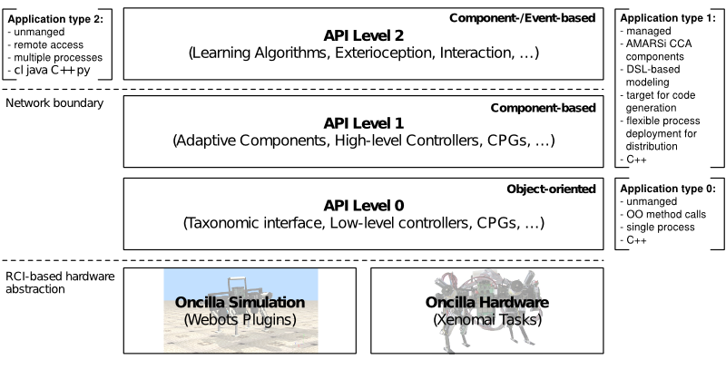

.. _examples:

==========
 Examples
==========

When setting up a new project with the :ref:`Project Wizard <wizard>` it will
come with a set of example to learn the usage of the simulation environment.

All following examples will execute a simple sine movement by moving the
:ref:`L1 and L2 joints <liboncilla:l1l2>` of the robot. You can ssart the
examples by opening the world files *worlds/Example...* in your project created
by the :ref:`Project Wizard <wizard>`. (*Start Webots* -> *Open World*)

The examples should be properly set up and compiled by the Project Wizard, and
should all perform the same movement, but use different **API levels** of the
Oncilla:

#. **API Level 0**
   is an C++ API defined by :ref:`liboncilla <liboncilla>`, that
   provides direct access to sensor values and sending command to the actuators.
   See Example 1 below.

#. **API Level 1**
   is defined in :ref:`libcca-oncilla <ccaoncilla>` and provides
   local component-level access by using the AMARSi Component Architecture
   :ref:`CCA <cca>`. Applications are implemented as reusable CCA components
   that can be combined to more complex systems and are managed by the
   framework. See Example 2 below for an example component.

#. **API Level 2**
   is similar to API Level 1 and also defined in
   :ref:`libcca-oncilla <ccaoncilla>` . It provides the same access as API Level
   1, but opens a remote interface by facilitating the middleware :ref:`RSB <rsb>`
   (Robotics Service Bus). This API level can be
   used by CCA component remotely over the network (running on different
   machines) and by arbitrary C++, Java and Python applications using
   :ref:`RSB <rsb>`.
   See Example 3 for a Python application. It also supports the usage of the
   :ref:`RSB tools <rsb>` like the logger or :ref:`RSBag <rsbag>` for recording
   and replaying movements, see Example 4.

Example 1: Simple Sine Movement
===============================

You should see the robot performing a simple walking movement, which is not a
necessarily meaningful walking gate. *;)*

For more information on the example and how to change and extend it, see
:ref:`Simple Sine Movement <liboncilla:example>`.

Example 2: Simple Sine Movement Component
=========================================

The second example will do exactly the same as Example 1, but is written as a
:ref:`CCA <cca>` component and therefore ready for usage in the AMARSi Software
Architecture.

For more information on the example and how to change and extend it, see
:ref:`Simple Sine Movement Component <ccaoncilla:ccaexample>`.

Example 3: External Components / Streaming 
==========================================

The third example will open a remote interface (API Level 2) and waits for
commands from external applications, scripts or tools. To show the
openness of the interface, the same movement as above is implemented as a
Python Script, that communicates with the Simulator over the middleware RSB
(Robotics Service Bus).

For more information on the example and how to change and extend it, see
:ref:`Python Simple Sine Movement <ccaoncilla:pythonexample>`.

Example 4: Recording and Replaying Movements 
============================================

The fourth example replays a previously recorded movement over the
middleware :ref:`RSB <rsb>` (Robotics Service Bus) by using :ref:`RSBag Tools
<rsbag>`.

For more information on the example and how to change and extend it, see
:ref:`Replaying Simple Sine Movement <ccaoncilla:rsbagexample>`.
