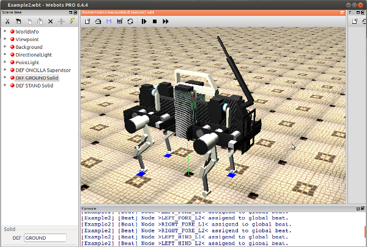

.. _oncilla-sim:

===========
 |project|
===========

|project| Manual (for version |version|)
========================================

|project| is the central project for the Oncilla Quadruped Simulation, developed
in the `AMARSi`_ project.
|project| contains a :ref:`Project Wizard <wizard>`, that helps you set up new
simulation projects and experiments, and installs :ref:`Examples <examples>` for the usage
of the different API layers.

The Simulator is based on the `Webots <http://www.cyberbotics.com/overview>`_
Simulator by Cyberbotics and requires a ``Webots PRO`` License. If you don't
have an appropriate license, you can also
`register at Cyberbotics <http://www.cyberbotics.com/my_account/register>`_ to
obtain free 30 day trial version of the ``Webots PRO`` License.

.. note::

   Currently |project| is compatible with Webots versions lower than 7.0. You
   can download older Webots 6.x versions (e.g. 6.4.4)
   `here <http://www.cyberbotics.com/archive/linux/>`_.
