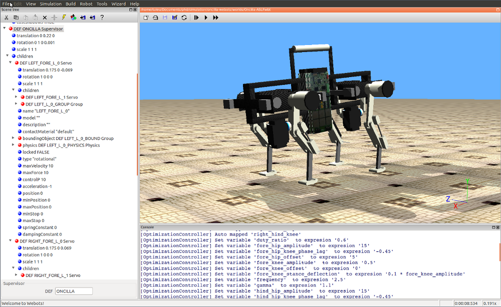

.. _oncilla-sim:

===========
 |project|
===========

|project| Manual (for version |version|)
========================================

|project| is the central project for the Oncilla Quadruped Simulation, developed
in the `AMARSi`_ project.
|project| contains a :ref:`Project Wizard <wizard>`, that helps you set up new
simulation projects and experiments, and installs :ref:`Examples <examples>` for the usage
of the different API layers.

The Simulator is based on the `Webots <http://www.cyberbotics.com/overview>`_
Simulator by Cyberbotics and requires a Webots ``PRO License``.  
